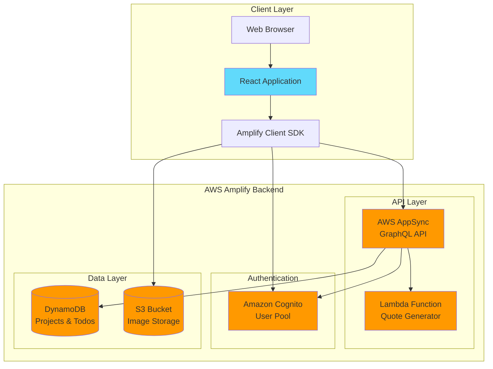
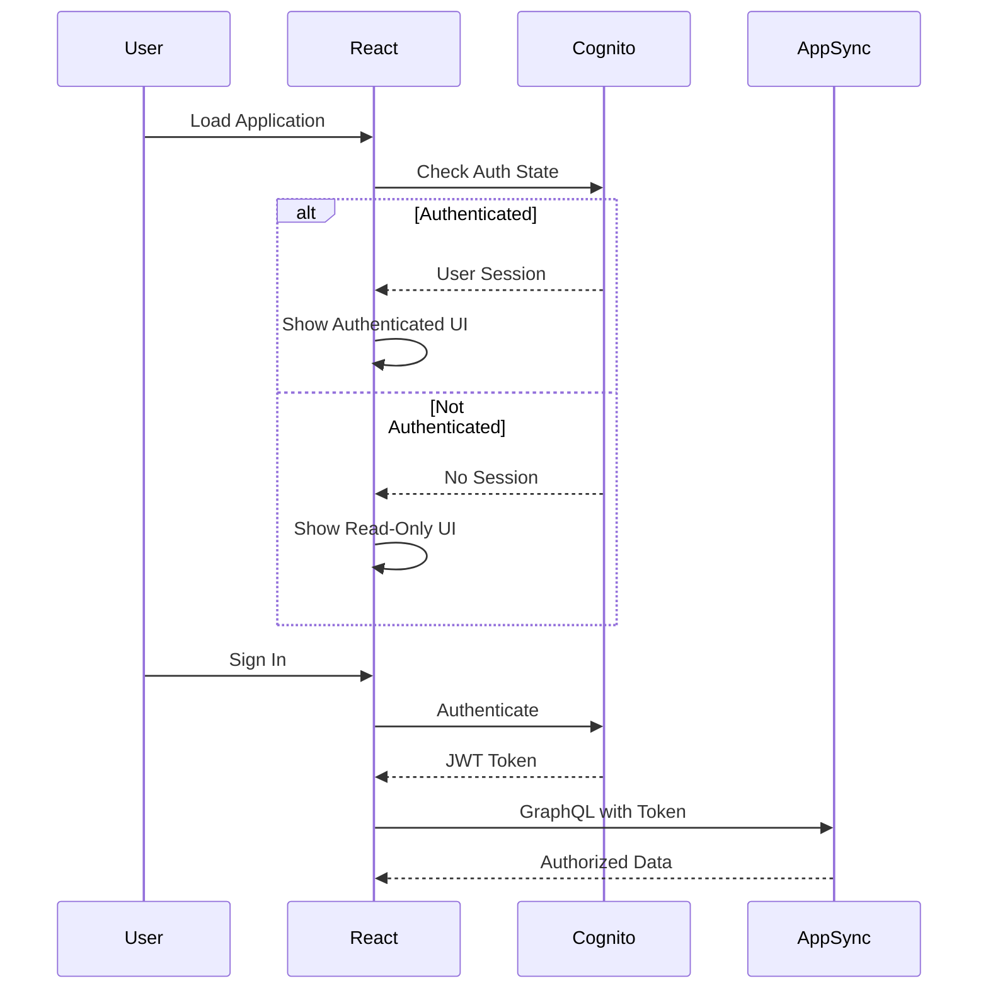
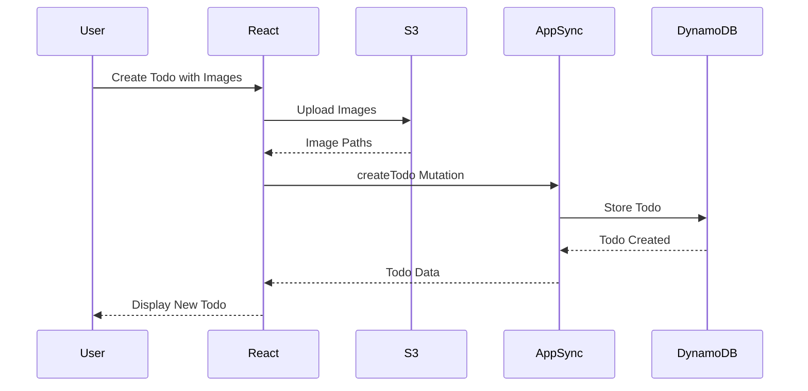
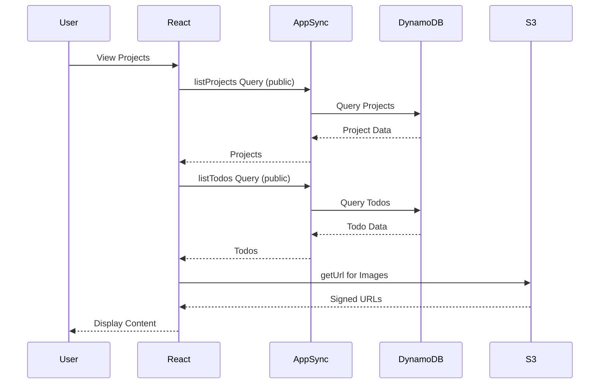

# Architecture Overview

## System Architecture

Project Boards is a serverless full-stack web application built on AWS Amplify Gen1. The architecture follows a three-tier pattern with a React frontend, AWS AppSync GraphQL API layer, and AWS managed services for data persistence and storage.

The application implements a dual-mode access pattern where unauthenticated users can view all content in read-only mode, while authenticated users can create, update, and delete their own resources. This is achieved through GraphQL authorization rules that distinguish between public read access and owner-based write access.

## Architecture Diagram



## Key Components

### Frontend Application (React + TypeScript)
**Purpose:** Single-page application providing the user interface
**Technology:** React 19, TypeScript, Vite
**Dependencies:** AWS Amplify SDK, Amplify UI React

The frontend is a React application that uses functional components with hooks for state management. It implements a theme system supporting light and dark modes, stored in localStorage. The application uses two GraphQL clients: one for authenticated operations (owner-based) and one for public read operations.

**Key Features:**
- Dual authentication modes (authenticated vs read-only)
- Theme switching (light/dark mode)
- Real-time data fetching with GraphQL
- Image upload and display with S3 integration
- Responsive design with inline styles

### GraphQL API (AWS AppSync)
**Purpose:** Provides unified API layer for all backend operations
**Technology:** AWS AppSync with GraphQL schema
**Dependencies:** DynamoDB, Lambda, Cognito

The GraphQL API is defined in `amplify/backend/api/stresstestapp/schema.graphql` and uses Amplify's `@model` directive to automatically generate CRUD operations. Authorization is handled through `@auth` rules that allow public read access and owner-based write access.

**Key Operations:**
- Project CRUD operations (create, read, update, delete)
- Todo CRUD operations with project associations
- Quote generation via Lambda function resolver
- Owner-based authorization for mutations

### Authentication (Amazon Cognito)
**Purpose:** User authentication and authorization
**Technology:** Amazon Cognito User Pool
**Dependencies:** None

Cognito manages user sign-up, sign-in, and session management. Users authenticate with email and password. The authentication state is checked on app load to determine whether to show the authenticated or read-only interface.

### Data Storage (DynamoDB)
**Purpose:** Persistent storage for projects and todos
**Technology:** Amazon DynamoDB
**Dependencies:** AppSync for access

DynamoDB stores two main entity types:
- **Projects**: Boards that organize todos with title, description, status, color, and deadline
- **Todos**: Individual tasks with name, description, images array, and optional project association

Tables are automatically created and managed by Amplify based on the GraphQL schema.

### Image Storage (S3)
**Purpose:** Store and serve todo images
**Technology:** Amazon S3
**Dependencies:** None

S3 stores uploaded images with public read access and authenticated write access. Images are stored with paths like `public/images/{timestamp}-{random}.{extension}`. The frontend uses `uploadData` to upload files and `getUrl` to retrieve signed URLs for display.

### Lambda Function (Quote Generator)
**Purpose:** Generate random inspirational quotes
**Technology:** AWS Lambda (Node.js)
**Dependencies:** None

A serverless function that returns random motivational quotes from a predefined array. Integrated with GraphQL via the `@function` directive, it's invoked through the `getRandomQuote` query.

## Data Flow

### Authentication Flow



### Todo Creation Flow



### Data Read Flow (Public)



## Technology Stack

- **Programming Language:** TypeScript/JavaScript
- **Frontend Framework:** React 19
- **Build Tool:** Vite 7
- **Backend Framework:** AWS Amplify Gen1
- **API:** GraphQL (AWS AppSync)
- **Database:** Amazon DynamoDB
- **Storage:** Amazon S3
- **Authentication:** Amazon Cognito
- **Functions:** AWS Lambda (Node.js)
- **Hosting:** AWS Amplify Console

## Design Principles

### 1. Serverless Architecture
The application is fully serverless, leveraging AWS managed services to eliminate server management overhead. This provides automatic scaling, high availability, and pay-per-use pricing.

### 2. Owner-Based Authorization
Resources (Projects and Todos) are owned by the user who creates them. The GraphQL schema uses `@auth` rules to enforce that only owners can modify or delete their resources, while allowing public read access.

### 3. Dual-Mode Access
The application supports both authenticated and unauthenticated access patterns. Unauthenticated users can browse all content in read-only mode, while authenticated users get full CRUD capabilities for their own resources.

### 4. Client-Side State Management
State is managed using React hooks (useState, useEffect) rather than external state management libraries. This keeps the application simple and reduces dependencies.

### 5. Inline Styling with Theme Support
Styles are defined as JavaScript objects and applied inline, with a theme system that dynamically adjusts colors based on light/dark mode preference stored in localStorage.

### 6. Type Safety
TypeScript is used throughout the frontend to provide compile-time type checking. GraphQL types are automatically generated into TypeScript interfaces in `src/API.ts`.

## Directory Structure

```
/
├── src/                          # Frontend source code
│   ├── App.tsx                  # Main application component (1000+ lines)
│   ├── main.tsx                 # Application entry point
│   ├── API.ts                   # Generated GraphQL TypeScript types
│   ├── App.css                  # Global styles
│   ├── index.css                # Base styles
│   ├── graphql/                 # GraphQL operations
│   │   ├── mutations.ts         # Create, update, delete operations
│   │   └── queries.ts           # Read operations
│   └── assets/                  # Static assets
├── amplify/                      # Amplify backend configuration
│   └── backend/                 # Backend resource definitions
│       ├── api/                 # GraphQL API
│       │   └── stresstestapp/
│       │       └── schema.graphql  # GraphQL schema definition
│       ├── auth/                # Cognito configuration
│       ├── storage/             # S3 bucket configuration
│       ├── function/            # Lambda functions
│       │   └── quotegenerator/
│       │       └── src/
│       │           └── index.js # Quote generator implementation
│       └── awscloudformation/   # CloudFormation templates
├── public/                       # Static public assets
├── docs/                        # Documentation
├── package.json                 # Dependencies and scripts
├── vite.config.ts              # Vite configuration
├── tsconfig.json               # TypeScript configuration
└── AGENTS.md                   # AI assistant guidelines
```

## Development Patterns

### GraphQL Client Pattern
The application uses two GraphQL clients to handle different authorization modes:

```typescript
// For authenticated operations (owner-based)
const authenticatedClient = generateClient({
  authMode: 'userPool',
});

// For public read operations
const publicClient = generateClient();
```

### Error Handling Pattern
All async operations use try-catch blocks with console logging:

```typescript
async function fetchProjects() {
  try {
    const projectData = await publicClient.graphql({
      query: listProjects,
    });
    setProjects(projectData.data.listProjects?.items || []);
  } catch (err) {
    console.log('Error fetching projects:', err);
  }
}
```

### Image Upload Pattern
Images are uploaded to S3 before creating the todo record:

```typescript
// Upload files to S3
const imageKeys: string[] = [];
for (const file of selectedFiles) {
  const result = await uploadData({
    path: `public/images/${fileName}`,
    data: file,
    options: { contentType: file.type },
  }).result;
  imageKeys.push(result.path);
}

// Create todo with image paths
const todoInput = {
  ...todoForm,
  images: imageKeys,
};
```

### Theme Pattern
Theme state is managed with React Context and persisted to localStorage:

```typescript
const [theme, setTheme] = useState<Theme>(() => {
  const saved = localStorage.getItem('theme');
  return (saved as Theme) || 'light';
});

const toggleTheme = () => {
  const newTheme = theme === 'light' ? 'dark' : 'light';
  setTheme(newTheme);
  localStorage.setItem('theme', newTheme);
};
```

## Security Considerations

### Authentication
- Email-based authentication via Cognito
- JWT tokens for API authorization
- Session management handled by Amplify SDK

### Authorization
- GraphQL `@auth` rules enforce owner-based access control
- Public read access for unauthenticated users
- Owner-only write access for authenticated users

### Data Protection
- S3 bucket configured with appropriate IAM policies
- CORS configuration for secure cross-origin requests
- No sensitive data stored in frontend code

## Scalability

### Automatic Scaling
- AppSync automatically scales to handle request volume
- DynamoDB on-demand pricing scales with usage
- S3 scales automatically for storage needs
- Lambda functions scale based on invocations

### Performance Optimization
- GraphQL queries fetch only required fields
- Images loaded on-demand with signed URLs
- Client-side caching via React state
- Vite build optimization for production

## AI Development Notes

When working on this system as an AI assistant:

1. **Always use the correct GraphQL client**: Use `authenticatedClient` for mutations and owner-based queries, `publicClient` for public read operations
2. **Handle authentication state**: Check if user is authenticated before showing edit/delete buttons
3. **Test both modes**: Verify functionality works for both authenticated and unauthenticated users
4. **Update GraphQL types**: Run `amplify push` after schema changes to regenerate `API.ts`
5. **Follow theme patterns**: Use `getThemedStyles(theme)` for all new UI components
6. **Handle async operations**: Always use try-catch blocks and loading states
7. **Image paths**: Store S3 paths in DynamoDB, not full URLs
8. **Owner field**: GraphQL automatically adds `owner` field to records, use it for authorization checks
