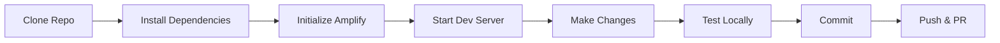

# Development Documentation

This directory contains guides and resources for developers working on the Project Boards application.

## Contents

### [Setup Guide](./setup.md)
Complete instructions for setting up your development environment, including:
- Prerequisites and required software
- Step-by-step setup process
- IDE configuration
- Common development tasks
- Troubleshooting setup issues

### [Contributing Guidelines](./contributing.md)
Guidelines for contributing to the project, including:
- Code style and conventions
- Development workflow
- Testing requirements
- Pull request process
- Code review checklist

## Quick Start

1. **Install Prerequisites:**
   - Node.js 25.x
   - AWS CLI
   - Amplify CLI

2. **Clone and Setup:**
   ```bash
   git clone <repository-url>
   cd stress-test-app
   npm install
   amplify init
   ```

3. **Start Development:**
   ```bash
   npm run dev
   ```

4. **Read the Guides:**
   - [Full Setup Guide](./setup.md)
   - [Contributing Guidelines](./contributing.md)

## Development Workflow



## Key Resources

- [Architecture Overview](../architecture/README.md)
- [API Documentation](../api/README.md)
- [Troubleshooting Guide](../operations/troubleshooting.md)
- [Main AGENTS.md](/AGENTS.md)

## Getting Help

- Check the [Setup Guide](./setup.md) for installation issues
- Review [Troubleshooting Guide](../operations/troubleshooting.md) for common problems
- See [Contributing Guidelines](./contributing.md) for workflow questions
