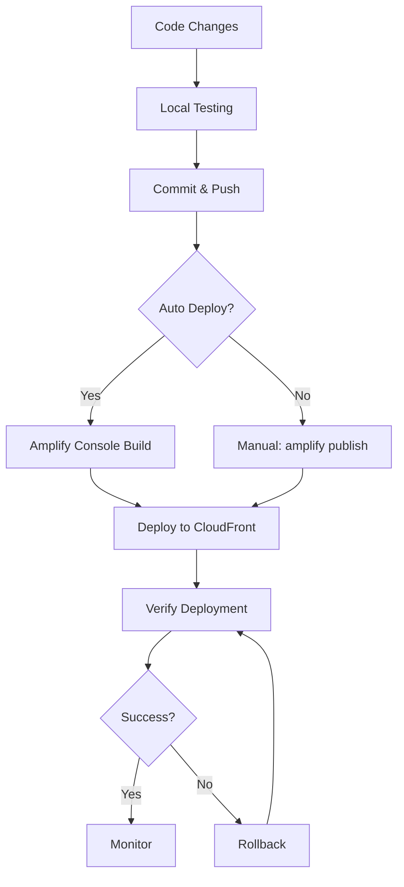

# Operations Documentation

This directory contains guides for deploying, monitoring, and troubleshooting the Project Boards application in production environments.

## Contents

### [Deployment Guide](./deployment.md)
Complete deployment instructions, including:
- Deployment methods (Amplify Console, manual, backend-only)
- Environment management (dev, staging, production)
- Pre-deployment checklist
- Post-deployment verification
- Rollback procedures
- Monitoring and observability
- Security considerations
- Cost optimization

### [Stress Testing Guide](./stress-testing.md)
Infrastructure stress testing documentation, including:
- 100 GraphQL model stress test
- AWS resource creation and limits
- Deployment metrics and performance
- Cleanup procedures
- Best practices for capacity testing

### [Troubleshooting Guide](./troubleshooting.md)
Comprehensive troubleshooting resources, including:
- Quick diagnostics
- Common issues and solutions
- Debug procedures
- Performance troubleshooting
- Getting help

## Quick Reference

### Deploy to Production

```bash
# Verify build
npm run build

# Check backend status
amplify status

# Deploy
amplify publish
```

### Check Application Health

```bash
# Backend status
amplify status

# View logs
aws logs tail /aws/lambda/quotegenerator --follow
```

### Rollback Deployment

```bash
# Revert to previous commit
git revert HEAD
git push origin main
```

## Deployment Workflow



## Monitoring Checklist

- [ ] CloudWatch metrics show normal patterns
- [ ] No error spikes in logs
- [ ] API latency within acceptable range
- [ ] Lambda functions executing successfully
- [ ] DynamoDB capacity adequate
- [ ] S3 storage within budget
- [ ] User authentication working
- [ ] Image uploads/downloads working

## Emergency Contacts

### AWS Support
- Console: https://console.aws.amazon.com/support/
- Phone: Available in AWS Console

### Internal Escalation
- Check team documentation for contact information

## Key Metrics to Monitor

### Application Health
- **API Success Rate:** > 99%
- **Average Latency:** < 500ms
- **Error Rate:** < 1%

### Infrastructure
- **Lambda Errors:** < 0.1%
- **DynamoDB Throttles:** 0
- **S3 Error Rate:** < 0.01%

### Business Metrics
- **Active Users:** Track daily/monthly
- **Projects Created:** Track growth
- **Todos Created:** Track engagement
- **Images Uploaded:** Track usage

## Operational Runbooks

### Incident Response

1. **Identify Issue:**
   - Check CloudWatch alarms
   - Review error logs
   - Check user reports

2. **Assess Impact:**
   - How many users affected?
   - What functionality is broken?
   - Is data at risk?

3. **Mitigate:**
   - Rollback if recent deployment
   - Scale resources if capacity issue
   - Fix and redeploy if bug

4. **Communicate:**
   - Update status page
   - Notify affected users
   - Document incident

5. **Post-Mortem:**
   - Root cause analysis
   - Prevention measures
   - Update runbooks

### Scaling Operations

**Increase Capacity:**
```bash
# DynamoDB (if using provisioned)
aws dynamodb update-table \
  --table-name <table-name> \
  --provisioned-throughput ReadCapacityUnits=100,WriteCapacityUnits=100

# Lambda (increase concurrency)
aws lambda put-function-concurrency \
  --function-name quotegenerator \
  --reserved-concurrent-executions 100
```

**Decrease Capacity:**
- Reverse above commands with lower values
- Monitor for throttling

### Backup and Recovery

**DynamoDB Backup:**
```bash
# Create on-demand backup
aws dynamodb create-backup \
  --table-name <table-name> \
  --backup-name backup-$(date +%Y%m%d)
```

**S3 Backup:**
- Enable versioning
- Configure lifecycle policies
- Use cross-region replication for critical data

## Cost Management

### Monthly Cost Targets

- **Development:** < $10/month
- **Staging:** < $50/month
- **Production:** Variable based on usage

### Cost Optimization Tips

1. **Use on-demand pricing** for variable workloads
2. **Enable S3 lifecycle policies** to archive old images
3. **Optimize Lambda memory** allocation
4. **Use CloudFront caching** effectively
5. **Clean up unused resources** regularly

## Security Operations

### Security Checklist

- [ ] IAM roles follow least privilege
- [ ] S3 buckets have proper policies
- [ ] Cognito password policies enforced
- [ ] API rate limiting configured
- [ ] CloudWatch alarms for suspicious activity
- [ ] Regular security audits
- [ ] Dependency updates applied

### Security Incident Response

1. **Detect:** Monitor CloudWatch, AWS GuardDuty
2. **Contain:** Disable compromised resources
3. **Investigate:** Review logs, identify scope
4. **Remediate:** Fix vulnerabilities, rotate credentials
5. **Recover:** Restore from backups if needed
6. **Learn:** Update security measures

## Related Documentation

- [Architecture Overview](../architecture/README.md)
- [API Documentation](../api/README.md)
- [Development Setup](../development/setup.md)
- [Services Overview](../services/README.md)

## Additional Resources

- [AWS Amplify Documentation](https://docs.amplify.aws/)
- [AWS Well-Architected Framework](https://aws.amazon.com/architecture/well-architected/)
- [AWS CloudWatch Documentation](https://docs.aws.amazon.com/cloudwatch/)
