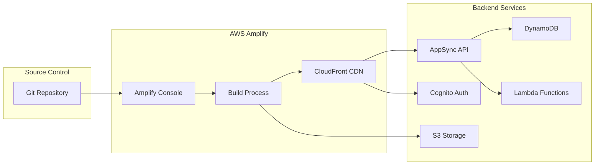

# Deployment Guide

## Overview

Project Boards uses AWS Amplify for deployment, which provides continuous deployment from Git repositories and manual deployment options. The application can be deployed to multiple environments (dev, staging, production).

## Deployment Architecture



## Prerequisites

Before deploying, ensure you have:

1. **AWS Account** with appropriate permissions
2. **Amplify CLI** installed and configured
3. **Git repository** with your code
4. **Backend resources** configured and tested locally
5. **Build passing** locally (`npm run build`)

## Deployment Methods

### Method 1: Amplify Console (Recommended for Production)

Amplify Console provides continuous deployment with Git integration.

#### Initial Setup

1. **Push code to Git repository:**
   ```bash
   git add .
   git commit -m "Prepare for deployment"
   git push origin main
   ```

2. **Add hosting category:**
   ```bash
   amplify add hosting
   ```

   Select options:
   ```
   ? Select the plugin module to execute: Hosting with Amplify Console
   ? Choose a type: Continuous deployment (Git-based deployments)
   ```

3. **Publish application:**
   ```bash
   amplify publish
   ```

   This will:
   - Deploy backend resources to AWS
   - Set up Amplify Console hosting
   - Configure continuous deployment
   - Provide a URL for your application

#### Configure Continuous Deployment

1. **Go to Amplify Console:**
   - Open AWS Console
   - Navigate to AWS Amplify
   - Select your app

2. **Connect repository:**
   - Click "Connect branch"
   - Select your Git provider (GitHub, GitLab, Bitbucket, etc.)
   - Authorize AWS Amplify
   - Select repository and branch

3. **Configure build settings:**
   ```yaml
   version: 1
   frontend:
     phases:
       preBuild:
         commands:
           - npm ci
       build:
         commands:
           - npm run build
     artifacts:
       baseDirectory: dist
       files:
         - '**/*'
     cache:
       paths:
         - node_modules/**/*
   ```

4. **Set environment variables (if needed):**
   - Go to App settings → Environment variables
   - Add any required variables
   - Example: `VITE_API_ENDPOINT`, `VITE_REGION`

5. **Save and deploy:**
   - Click "Save and deploy"
   - Monitor build progress
   - Access deployed app via provided URL

### Method 2: Manual Deployment

For quick deployments or testing:

```bash
# Build the application
npm run build

# Deploy backend and frontend
amplify publish
```

This command:
1. Runs `amplify push` to deploy backend
2. Builds the frontend
3. Deploys to Amplify hosting
4. Provides deployment URL

### Method 3: Backend Only Deployment

To deploy only backend changes:

```bash
amplify push
```

This updates:
- GraphQL API schema
- Lambda functions
- DynamoDB tables
- S3 bucket configuration
- Cognito user pool settings

## Environment Management

### Creating Multiple Environments

**Development Environment:**
```bash
amplify env add dev
amplify push
```

**Staging Environment:**
```bash
amplify env add staging
amplify push
```

**Production Environment:**
```bash
amplify env add prod
amplify push
```

### Switching Between Environments

```bash
# List all environments
amplify env list

# Switch to specific environment
amplify env checkout dev
amplify env checkout staging
amplify env checkout prod
```

### Environment-Specific Configuration

Each environment has its own:
- Backend resources (separate DynamoDB tables, S3 buckets, etc.)
- API endpoints
- Cognito user pools
- CloudFormation stacks

## Deployment Process

### Pre-Deployment Checklist

- [ ] All tests pass locally
- [ ] Code is linted: `npm run lint`
- [ ] TypeScript compiles: `tsc -b`
- [ ] Build succeeds: `npm run build`
- [ ] Backend status is clean: `amplify status`
- [ ] Environment variables are configured
- [ ] Documentation is updated
- [ ] Git repository is up to date

### Step-by-Step Deployment

**1. Verify local build:**
```bash
npm run build
npm run preview
```

Test the production build locally.

**2. Check backend status:**
```bash
amplify status
```

Ensure no unexpected changes.

**3. Deploy backend changes:**
```bash
amplify push
```

Review and confirm changes.

**4. Deploy frontend:**
```bash
amplify publish
```

Or push to Git for automatic deployment.

**5. Verify deployment:**
- Visit deployed URL
- Test authentication
- Test CRUD operations
- Check both light and dark modes
- Verify responsive design

### Post-Deployment Verification

**1. Smoke Tests:**
```bash
# Test API endpoint
curl https://your-api-endpoint/graphql

# Check CloudFront distribution
curl -I https://your-app-url.amplifyapp.com
```

**2. Functional Tests:**
- Sign in/sign out
- Create project
- Create todo
- Upload image
- Update records
- Delete records

**3. Monitor Logs:**
```bash
# Lambda logs
aws logs tail /aws/lambda/quotegenerator --follow

# AppSync logs
aws logs tail /aws/appsync/apis/<api-id> --follow
```

## Configuration Management

### Environment Variables

**Local Development (.env.local):**
```bash
VITE_API_ENDPOINT=https://dev-api.example.com
VITE_REGION=us-east-1
```

**Amplify Console:**
1. Go to App settings → Environment variables
2. Add variables for each environment
3. Variables are injected during build

### Backend Configuration

**GraphQL API:**
- Configured in `amplify/backend/api/stresstestapp/`
- Schema: `schema.graphql`
- Resolvers: Auto-generated by Amplify

**Authentication:**
- Configured in `amplify/backend/auth/`
- User pool settings
- OAuth configuration (if applicable)

**Storage:**
- Configured in `amplify/backend/storage/`
- S3 bucket settings
- Access permissions

**Functions:**
- Configured in `amplify/backend/function/`
- Lambda function code
- Environment variables
- IAM permissions

## Rollback Procedures

### Rolling Back Frontend

**Amplify Console:**
1. Go to Amplify Console
2. Select your app
3. Click on deployment history
4. Select previous successful deployment
5. Click "Redeploy this version"

**Manual Rollback:**
```bash
# Checkout previous commit
git checkout <previous-commit-hash>

# Deploy
amplify publish
```

### Rolling Back Backend

**Using CloudFormation:**
1. Go to CloudFormation console
2. Find your Amplify stack
3. Select stack
4. Click "Update"
5. Choose "Replace current template"
6. Upload previous template
7. Update stack

**Using Amplify:**
```bash
# Pull previous environment state
amplify env checkout <environment>
amplify pull

# Push to restore
amplify push
```

### Emergency Rollback

If deployment causes critical issues:

```bash
# Immediately revert to previous Git commit
git revert HEAD
git push origin main

# Or force push previous commit
git reset --hard <previous-commit>
git push --force origin main
```

## Monitoring and Observability

### CloudWatch Metrics

**Key Metrics to Monitor:**
- API request count
- Error rate
- Latency (p50, p95, p99)
- Lambda invocations
- Lambda errors
- DynamoDB read/write capacity

**Setting Up Alarms:**
```bash
# Create alarm for high error rate
aws cloudwatch put-metric-alarm \
  --alarm-name high-error-rate \
  --alarm-description "Alert when error rate exceeds 5%" \
  --metric-name Errors \
  --namespace AWS/AppSync \
  --statistic Average \
  --period 300 \
  --threshold 5 \
  --comparison-operator GreaterThanThreshold
```

### Logging

**Enable AppSync Logging:**
1. Go to AppSync console
2. Select your API
3. Go to Settings
4. Enable logging
5. Set log level (ERROR, ALL, etc.)

**Lambda Logging:**
- Automatically logged to CloudWatch
- View in CloudWatch Logs console
- Search and filter logs

### Performance Monitoring

**CloudWatch Insights Queries:**

```sql
# Find slow GraphQL queries
fields @timestamp, @message
| filter @message like /duration/
| parse @message /duration: (?<duration>\d+)/
| filter duration > 1000
| sort duration desc
```

```sql
# Count errors by type
fields @timestamp, @message
| filter @message like /error/
| stats count() by @message
```

## Security Considerations

### Pre-Deployment Security Checklist

- [ ] No hardcoded credentials in code
- [ ] Environment variables properly configured
- [ ] IAM roles follow least privilege principle
- [ ] S3 bucket policies are restrictive
- [ ] Cognito user pool has appropriate settings
- [ ] API has rate limiting configured
- [ ] CORS is properly configured
- [ ] HTTPS is enforced

### Security Best Practices

**1. Secrets Management:**
```bash
# Never commit secrets
echo "*.env.local" >> .gitignore
echo "amplifyconfiguration.json" >> .gitignore
```

**2. IAM Permissions:**
- Use separate IAM roles for each environment
- Grant minimum required permissions
- Regularly audit permissions

**3. API Security:**
- Enable WAF for AppSync (production)
- Configure rate limiting
- Monitor for suspicious activity

**4. Data Protection:**
- Enable S3 bucket encryption
- Enable DynamoDB encryption at rest
- Use HTTPS for all communications

## Scaling Considerations

### Automatic Scaling

**DynamoDB:**
- Uses on-demand pricing by default
- Automatically scales with traffic
- No capacity planning needed

**Lambda:**
- Automatically scales with invocations
- Configure reserved concurrency if needed
- Monitor throttling metrics

**AppSync:**
- Automatically scales
- Default limit: 1,000 requests/second
- Request limit increase if needed

**S3:**
- Automatically scales
- No configuration needed
- Monitor request rates

### Performance Optimization

**1. CloudFront Caching:**
- Static assets cached at edge locations
- Reduces latency
- Lowers origin load

**2. GraphQL Query Optimization:**
- Request only needed fields
- Use pagination for large datasets
- Implement DataLoader pattern if needed

**3. Image Optimization:**
- Compress images before upload
- Use appropriate formats (WebP, JPEG)
- Implement lazy loading

## Cost Optimization

### Cost Monitoring

**Set Up Billing Alerts:**
1. Go to AWS Billing console
2. Create budget
3. Set threshold
4. Configure email alerts

**Monitor Service Costs:**
- AppSync: Per request pricing
- Lambda: Per invocation + duration
- DynamoDB: On-demand pricing
- S3: Storage + requests
- CloudFront: Data transfer

### Cost Reduction Strategies

**1. Optimize GraphQL Queries:**
- Reduce unnecessary data fetching
- Implement caching
- Use pagination

**2. Lambda Optimization:**
- Optimize function memory
- Reduce cold starts
- Minimize dependencies

**3. S3 Optimization:**
- Use lifecycle policies
- Delete unused objects
- Compress files

**4. DynamoDB Optimization:**
- Use on-demand for variable workloads
- Use provisioned for predictable workloads
- Implement TTL for temporary data

## Troubleshooting Deployment Issues

### Common Deployment Errors

**Build Failures:**
```bash
# Check build logs in Amplify Console
# Or run locally:
npm run build
```

**Backend Deployment Failures:**
```bash
# Check CloudFormation events
amplify push --debug
```

**Permission Errors:**
- Verify IAM permissions
- Check CloudFormation stack events
- Review CloudWatch logs

### Getting Help

- Check [Troubleshooting Guide](./troubleshooting.md)
- Review CloudFormation stack events
- Check CloudWatch logs
- Contact AWS Support

## Related Documentation

- [Architecture Overview](../architecture/README.md)
- [Development Setup](../development/setup.md)
- [Troubleshooting Guide](./troubleshooting.md)
- [API Documentation](../api/README.md)
