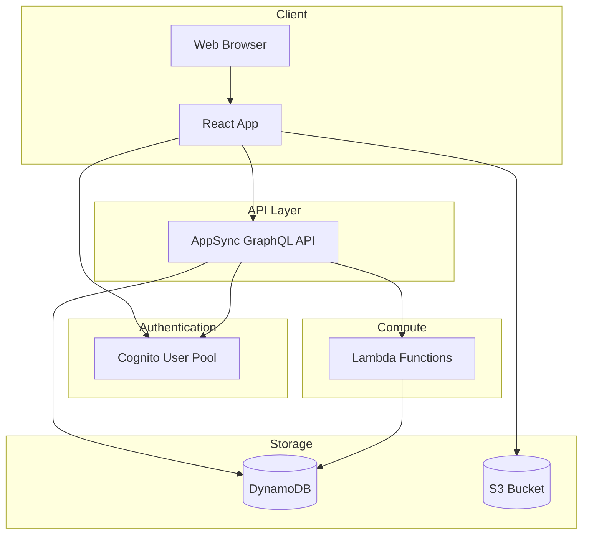

# Services Overview

This directory contains detailed documentation for each major component and service in the Project Boards application.

## Service Architecture

Project Boards is built on a serverless architecture using AWS Amplify Gen1. The application consists of several interconnected services that work together to provide a complete project management solution.

## Core Services

### [Frontend Application](./frontend.md)
**Technology:** React 19 + TypeScript + Vite  
**Purpose:** Single-page application providing the user interface

The frontend is a React application that handles all user interactions, state management, and communication with backend services. It implements a dual-mode access pattern (authenticated vs read-only) and supports light/dark themes.

**Key Features:**
- Responsive design
- Theme switching
- Real-time data updates
- Image upload and display
- Owner-based authorization

### [GraphQL API](./graphql-api.md)
**Technology:** AWS AppSync  
**Purpose:** Unified API layer for all backend operations

The GraphQL API provides a single endpoint for all data operations, with automatic CRUD generation from the schema. It handles authentication, authorization, and data validation.

**Key Features:**
- Auto-generated resolvers
- Owner-based authorization
- Public read access
- Lambda function integration
- Real-time subscriptions (available but not currently used)

### [Authentication Service](./authentication.md)
**Technology:** Amazon Cognito  
**Purpose:** User authentication and session management

Cognito manages user sign-up, sign-in, password reset, and session management. It provides JWT tokens for API authorization.

**Key Features:**
- Email-based authentication
- Password policies
- Session management
- JWT token generation
- User pool management

### [Data Storage](./data-storage.md)
**Technology:** Amazon DynamoDB  
**Purpose:** Persistent storage for projects and todos

DynamoDB provides scalable, low-latency storage for application data. Tables are automatically created and managed by Amplify based on the GraphQL schema.

**Key Features:**
- Automatic scaling
- On-demand pricing
- Owner-based access control
- Automatic timestamps
- Global secondary indexes

### [Image Storage](./image-storage.md)
**Technology:** Amazon S3  
**Purpose:** Store and serve todo images

S3 provides scalable object storage for uploaded images with public read access and authenticated write access.

**Key Features:**
- Unlimited storage
- Signed URL generation
- CORS configuration
- Automatic scaling
- Lifecycle policies

### [Quote Generator Function](./quote-generator.md)
**Technology:** AWS Lambda (Node.js)  
**Purpose:** Generate random inspirational quotes

A serverless function that returns motivational quotes from a predefined array, integrated with GraphQL via the `@function` directive.

**Key Features:**
- Serverless execution
- GraphQL integration
- No cold start optimization needed
- Simple stateless operation

## Service Interactions

## Data Flow Patterns

### Read Operations (Public)
1. User loads application
2. React app queries AppSync (public client)
3. AppSync retrieves data from DynamoDB
4. Data returned to React app
5. React app fetches image URLs from S3
6. Images displayed to user

### Write Operations (Authenticated)
1. User authenticates with Cognito
2. Cognito returns JWT token
3. User creates/updates resource
4. React app sends mutation to AppSync (authenticated client)
5. AppSync validates JWT token
6. AppSync checks owner authorization
7. AppSync writes to DynamoDB
8. Success response returned to React app

### Image Upload Flow
1. User selects images
2. React app uploads to S3 (authenticated)
3. S3 returns image paths
4. React app creates todo with image paths
5. AppSync stores paths in DynamoDB
6. When displaying, React app gets signed URLs from S3

## Service Dependencies

### Frontend Dependencies
- **AppSync:** For all data operations
- **Cognito:** For authentication
- **S3:** For image upload/display

### AppSync Dependencies
- **Cognito:** For authentication validation
- **DynamoDB:** For data persistence
- **Lambda:** For custom resolvers

### Lambda Dependencies
- **None:** Stateless function with no external dependencies

## Service Boundaries

### Frontend Responsibilities
- User interface rendering
- State management
- Input validation
- Error handling
- Theme management
- Routing (if applicable)

### API Responsibilities
- Request validation
- Authorization enforcement
- Data transformation
- Error responses
- Rate limiting

### Authentication Responsibilities
- User registration
- Login/logout
- Password management
- Token generation
- Session management

### Storage Responsibilities
- Data persistence
- Query execution
- Index management
- Backup/restore

## Scaling Characteristics

### Frontend
- **Scaling:** Via CloudFront CDN
- **Limits:** None (static assets)
- **Cost:** Based on data transfer

### AppSync
- **Scaling:** Automatic
- **Limits:** 1,000 requests/second (default)
- **Cost:** Per request

### Cognito
- **Scaling:** Automatic
- **Limits:** Varies by operation
- **Cost:** Per monthly active user

### DynamoDB
- **Scaling:** Automatic (on-demand)
- **Limits:** None (on-demand mode)
- **Cost:** Per request + storage

### S3
- **Scaling:** Automatic
- **Limits:** None
- **Cost:** Per storage + requests

### Lambda
- **Scaling:** Automatic
- **Limits:** 1,000 concurrent executions (default)
- **Cost:** Per invocation + duration

## Monitoring and Observability

### Key Metrics by Service

**Frontend:**
- Page load time
- Time to interactive
- Error rate
- User sessions

**AppSync:**
- Request count
- Error rate
- Latency (p50, p95, p99)
- Throttled requests

**Cognito:**
- Sign-in success rate
- Sign-in failures
- Token generation rate

**DynamoDB:**
- Read/write capacity
- Throttled requests
- Item count
- Storage size

**S3:**
- Request count
- Error rate
- Data transfer
- Storage size

**Lambda:**
- Invocation count
- Error rate
- Duration
- Throttles

### Logging Strategy

**Frontend:**
- Browser console logs
- Error tracking (if configured)

**AppSync:**
- CloudWatch Logs
- Request/response logging
- Resolver logs

**Lambda:**
- CloudWatch Logs
- Structured logging
- Error tracking

## Security Considerations

### Frontend Security
- No sensitive data in code
- HTTPS only
- Content Security Policy
- XSS prevention

### API Security
- JWT token validation
- Owner-based authorization
- Rate limiting
- Input validation

### Authentication Security
- Password policies
- MFA support (if enabled)
- Secure token storage
- Session timeout

### Storage Security
- Encryption at rest
- Encryption in transit
- IAM policies
- Bucket policies

## Service-Specific Documentation

For detailed information about each service, see:

- [Frontend Application](./frontend.md)
- [GraphQL API](./graphql-api.md)
- [Authentication Service](./authentication.md)
- [Data Storage](./data-storage.md)
- [Image Storage](./image-storage.md)
- [Quote Generator Function](./quote-generator.md)

## Related Documentation

- [Architecture Overview](../architecture/README.md)
- [API Documentation](../api/README.md)
- [Development Setup](../development/setup.md)
- [Deployment Guide](../operations/deployment.md)
